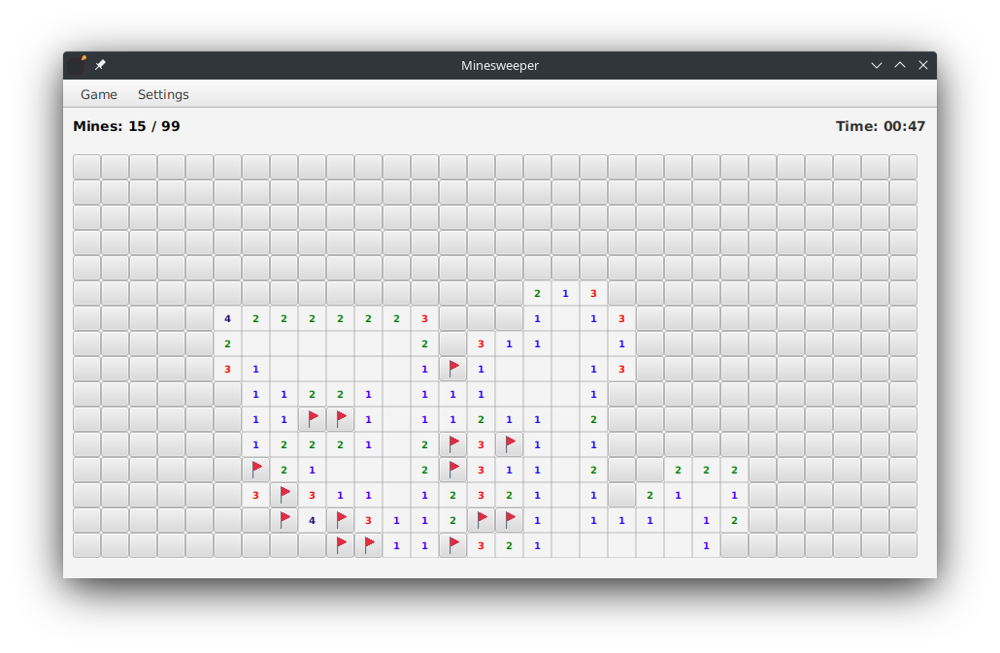

# jfxmines

Minesweeper game in JavaFX



## Compilation and execution

Make sure you have Java 11 and Maven installed.

Clone the repository and create a JAR using Maven:

```
git clone https://github.com/rbelohl/jfxmines.git
cd jfxmines
mvn package
```

Then run the JAR in the `target/` directory:

```
cd target
java -jar jfxmines.jar

```
